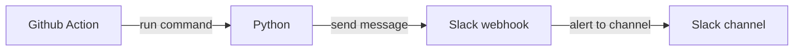

# GitHub Pull Request Reminder

## Development Environment
- Python
- Slack
- Github Action

## Flow
- Github Action -> Python -> Slack webhook -> Slack channel


## Configuration
- conf.py
  - ```python
    {
        'slack_notification': "on", # slack notication option : on, off
        'repo_list': [
            # [git token , repo name, slack webhook url]
            [
                'xxx',
                ["y/xxx", "y/zzz"],
                "https://hooks.slack.com/services/xxx/xxx/xxx"
            ],
            [
                'xxx-1',
                ["y/xxx-1", "y/zzz-1"],
                "https://hooks.slack.com/services/xxx/xxx/xxx-1"
            ]
        ]
    }
    ```

## Command

### Run

- ```shell
  ./job/pull_request_reminder/pull_request_reminder.py --slack-notification on
  ```
 